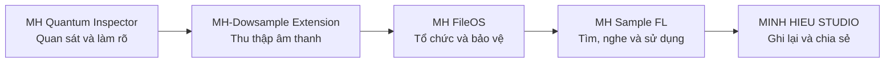
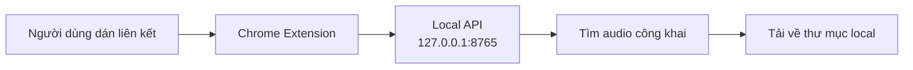

<div align="center">

# MH-Dowsample Extension

### Lớp thu thập âm thanh local-first trong hệ sinh thái công cụ MH


[Website](https://studiominhhieu.com/) · [GitHub](https://github.com/studiozengermany-cmd) · [Liên hệ](mailto:support@studiominhhieu.com)

</div>

> [!IMPORTANT]
> **MH-Dowsample Extension đang trong giai đoạn phát triển.** Công cụ được xây dựng trước hết cho quy trình thu thập sample của Minh Hiếu. Source hiện có workflow dán liên kết, tìm đường dẫn âm thanh công khai và tải file về máy qua dịch vụ local. Dự án chưa được phát hành trên Chrome Web Store và chưa được tuyên bố là bản ổn định cho mọi website.

## Mục lục

- [Vì sao dự án này tồn tại?](#vì-sao-dự-án-này-tồn-tại)
- [Vị trí trong hệ sinh thái MH](#vị-trí-trong-hệ-sinh-thái-mh)
- [Khả năng hiện có](#khả-năng-hiện-có)
- [Cách hoạt động](#cách-hoạt-động)
- [Cài đặt trên Windows](#cài-đặt-trên-windows)
- [Hướng dẫn sử dụng](#hướng-dẫn-sử-dụng)
- [Nơi lưu file](#nơi-lưu-file)
- [An toàn và quyền riêng tư](#an-toàn-và-quyền-riêng-tư)
- [Giới hạn hiện tại](#giới-hạn-hiện-tại)
- [Kiểm thử](#kiểm-thử)
- [Cấu trúc dự án](#cấu-trúc-dự-án)
- [Nguyên tắc phát triển](#nguyên-tắc-phát-triển)
- [Liên hệ](#liên-hệ)

## Vì sao dự án này tồn tại?

Trong quá trình làm nhạc, việc mở từng trang, tìm đúng đường dẫn âm thanh rồi tải và kiểm tra từng file làm mất nhiều thời gian. MH-Dowsample Extension được tạo để rút ngắn phần việc lặp lại đó:

- nhận liên kết do người dùng chủ động cung cấp;
- tìm các đường dẫn âm thanh công khai trên trang;
- tải file về máy local mà không ghi đè file đã có;
- hiển thị tiến trình và kết quả ngay trong popup;
- giữ quá trình thu thập tách biệt với bước quản lý và sử dụng sample.

Mục tiêu là giảm thao tác kỹ thuật để Minh Hiếu dành nhiều thời gian hơn cho công việc sản xuất âm nhạc.

## Vị trí trong hệ sinh thái MH

Các dự án mang tiền tố **MH** là những lớp liên kết trong cùng một quy trình, không phải các repository rời rạc.



MH-Dowsample Extension là lớp **thu thập**. Công cụ đưa file âm thanh từ nguồn công khai về máy local; các bước tổ chức, phân tích, quản lý thư viện và sử dụng trong FL Studio thuộc những lớp tiếp theo của hệ sinh thái.

## Khả năng hiện có

| Nhóm | Khả năng trong source hiện tại |
|---|---|
| Nhập nguồn | Nhận một liên kết HTTP hoặc HTTPS do người dùng dán vào popup |
| Tìm âm thanh | Đọc Splice public sample page hoặc trang có đường dẫn audio công khai |
| Tải file | Tải file gốc/preview được tìm thấy về máy local |
| Xử lý nhóm | Chia tối đa 200 đường dẫn mỗi nhóm, tải đồng thời tối đa 4 file |
| Chống ghi đè | Tự thêm `(2)`, `(3)` khi tên file đã tồn tại |
| An toàn khi tải | Ghi vào file `.part`, chỉ đổi thành file chính sau khi tải xong |
| Theo dõi | Hiển thị trạng thái server, quá trình tìm link, tiến trình tải và kết quả |
| Tiếp tục theo dõi | Lưu job gần nhất trong `chrome.storage.local` để popup mở lại vẫn xem được |

Những khả năng trên mô tả source hiện có, không thay thế việc nghiệm thu trên máy Windows thật và nguồn dữ liệu thật.

## Cách hoạt động



Extension không tự tải âm thanh khi người dùng chưa bấm nút. Backend chỉ lắng nghe trên địa chỉ loopback `127.0.0.1:8765`.

## Cài đặt trên Windows

### Yêu cầu

- Windows 10 hoặc Windows 11.
- Python 3.
- Google Chrome hoặc trình duyệt Chromium hỗ trợ Manifest V3.
- Repository đã được clone hoặc tải về máy.

### Thiết lập lần đầu

1. Chạy `SETUP.cmd` để tạo môi trường Python local.
2. Chạy `START-SERVER.cmd` và giữ cửa sổ server mở trong lúc sử dụng.
3. Chạy `INSTALL-EXTENSION.cmd` để mở trang quản lý extension và thư mục cần nạp.
4. Tại `chrome://extensions/`, bật **Chế độ dành cho nhà phát triển**.
5. Chọn **Tải tiện ích đã giải nén**.
6. Chọn thư mục `extension` trong repository này.

Khi source được cập nhật, kéo code mới về máy rồi bấm **Tải lại** trên thẻ extension.

## Hướng dẫn sử dụng

1. Khởi động `START-SERVER.cmd`.
2. Mở popup **MH-Dowsample Extension** trên thanh công cụ Chrome.
3. Kiểm tra trạng thái **Server kết nối**.
4. Dán liên kết Splice hoặc liên kết audio trực tiếp.
5. Bấm **Quét và tải âm thanh**.
6. Theo dõi số file đã tìm thấy, đã tải và lỗi tải.
7. Bấm **Mở thư mục tải** khi công việc hoàn tất.

Có thể đóng popup trong lúc backend đang tải. Mở lại popup để tiếp tục xem job gần nhất.

## Nơi lưu file

Trên máy Windows có ổ `J:`, thư mục mặc định là:

```text
J:\MH-Audio-Downloads
```

Nếu không có ổ `J:`, ứng dụng dùng thư mục:

```text
Downloads\MH-Audio-Downloads
```

Có thể đổi thư mục gốc bằng biến môi trường `MH_AUDIO_DOWNLOAD_DIR` trước khi mở server.

## An toàn và quyền riêng tư

- Backend chỉ lắng nghe tại `127.0.0.1`, không mở dịch vụ ra mạng LAN hoặc Internet.
- Extension chỉ được cấp quyền lưu trạng thái local và gọi local API tại cổng `8765`.
- File đang tải dùng đuôi `.part` để tránh xem file chưa hoàn chỉnh như kết quả cuối.
- File đã tồn tại không bị ghi đè.
- Người dùng phải tự kiểm tra quyền sử dụng, điều khoản nguồn và license của âm thanh trước khi sử dụng hoặc phân phối.
- Không nên dán liên kết chứa token, thông tin đăng nhập hoặc dữ liệu riêng tư.

Local-first không tự động đồng nghĩa với an toàn tuyệt đối; người dùng vẫn cần kiểm tra nguồn và file đầu ra.

## Giới hạn hiện tại

- Chưa kiểm thử trên mọi website và mọi kiểu trình phát âm thanh.
- Ưu tiên Splice public sample pages và liên kết audio trực tiếp.
- Không vượt qua đăng nhập, paywall, DRM hoặc cơ chế bảo vệ của nguồn.
- Chưa phát hành trên Chrome Web Store.
- Chưa có security audit độc lập.
- Chưa có bộ cài tự động hoàn chỉnh cho người dùng cuối.
- Kết quả còn phụ thuộc cấu trúc trang và việc nguồn có cung cấp đường dẫn âm thanh công khai hay không.

## Kiểm thử

Chạy test hiện có bằng PowerShell:

```powershell
.\.venv\Scripts\python.exe -m unittest discover -s tests -v
```

Test tự động hiện kiểm tra một số phần của crawler như chọn preview Splice, đọc pagination và chuẩn hóa tên file Windows. Test thành công không đồng nghĩa toàn bộ extension đã được nghiệm thu trên Chrome và dữ liệu thật.

## Cấu trúc dự án

```text
MH-Dowsampl.Extension/
├─ extension/
│  ├─ manifest.json
│  ├─ popup.html
│  ├─ popup.css
│  └─ popup.js
├─ backend/
│  ├─ crawler.py
│  ├─ server.py
│  └─ requirements.txt
├─ tests/
├─ SETUP.cmd
├─ START-SERVER.cmd
└─ INSTALL-EXTENSION.cmd
```

## Nguyên tắc phát triển

1. Bắt đầu từ nhu cầu thật trong quy trình làm nhạc.
2. Người dùng quyết định nguồn, phạm vi và thời điểm tải.
3. Dữ liệu và tiến trình hiển thị phải đến từ backend thật, không dùng số giả.
4. Không ghi đè file đã tồn tại.
5. Không mô tả mockup, build hoặc source chưa nghiệm thu như sản phẩm hoàn thiện.
6. Không bắt buộc cloud, API key hoặc gói trả phí cho workflow cốt lõi.
7. README phải nói rõ vị trí trong hệ sinh thái MH, cách dùng, giới hạn và trách nhiệm của người dùng.

## Liên hệ

- Website: https://studiominhhieu.com/
- Email: support@studiominhhieu.com
- GitHub: https://github.com/studiozengermany-cmd

---

<div align="center">

**Ý tưởng, mục tiêu và quyết định sản phẩm: Minh Hiếu**  
AI được sử dụng như công cụ hỗ trợ nghiên cứu và thực hiện; quyết định cuối cùng vẫn thuộc về chủ dự án.

**Thu thập có kiểm soát → tổ chức an toàn → sử dụng hiệu quả.**

</div>
